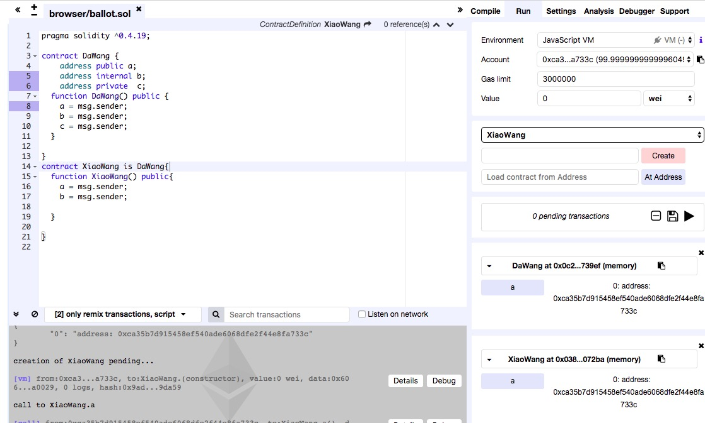

# **solidity智能合约之 常用的关键词**
# public internal private  的区别

 ```sol
 pragma solidity ^0.4.19;

contract DaWang {
    address public a;
    address internal b;
    address private  c;
  function DaWang() public {
    a = msg.sender;
    b = msg.sender;
    c = msg.sender;
  }

}
contract XiaoWang is DaWang{
  function XiaoWang() public{
    a = msg.sender;
    b = msg.sender;

  }

}

 ```
 - 根据运行的结果可以知道
 
 - **public **
 >  权限最大,子类可以继承
 >  默认有get方法
 >  当前可以访问

 - **internal **
 >  子类可以继承
 >  子类可以访问

 - **private **
 >  子类不可以继承
 >  子类不可以访问
